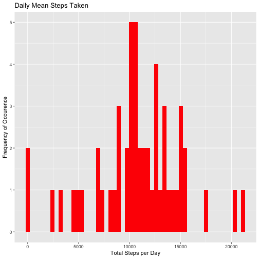
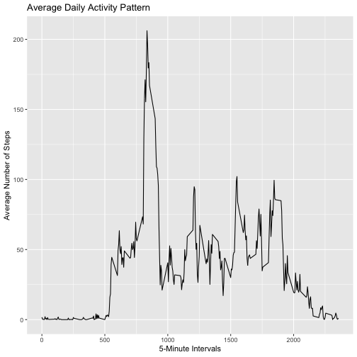
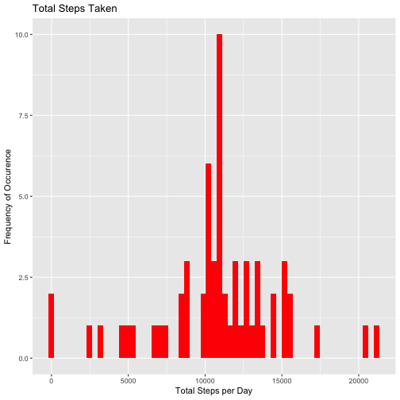
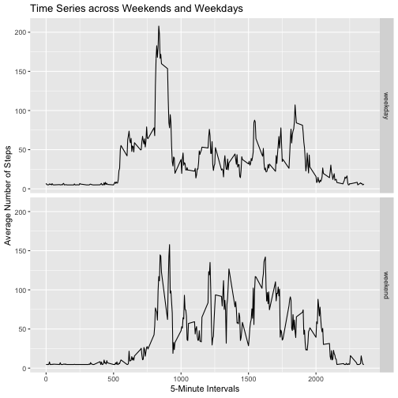

Reproducible Research - Course Project 1
========================================

## Evaluation of Activity Monitoring Data ##

This assignment makes use of data from a personal activity monitoring device. 
This device collects data at 5 minute intervals throughout the day. The data 
consists of two months of data from an anonymous individual collected during 
the months of October and November, 2012 and includes the number of steps taken 
in 5 minute intervals each day.

First load required libraries

```r
library(ggplot2)
```

```
## Want to understand how all the pieces fit together? See the R for
## Data Science book: http://r4ds.had.co.nz/
```

```r
library(tidyverse)
```

```
## ── Attaching packages ────────────────────────────────── tidyverse 1.2.1 ──
```

```
## ✔ tibble  1.4.2     ✔ purrr   0.2.5
## ✔ tidyr   0.8.1     ✔ dplyr   0.7.6
## ✔ readr   1.1.1     ✔ stringr 1.3.1
## ✔ tibble  1.4.2     ✔ forcats 0.3.0
```

```
## Warning: package 'dplyr' was built under R version 3.5.1
```

```
## ── Conflicts ───────────────────────────────────── tidyverse_conflicts() ──
## ✖ dplyr::filter() masks stats::filter()
## ✖ dplyr::lag()    masks stats::lag()
```

```r
library(Hmisc)
```

```
## Loading required package: lattice
```

```
## Loading required package: survival
```

```
## Loading required package: Formula
```

```
## 
## Attaching package: 'Hmisc'
```

```
## The following objects are masked from 'package:dplyr':
## 
##     src, summarize
```

```
## The following objects are masked from 'package:base':
## 
##     format.pval, units
```

```r
library(scales)
```

```
## 
## Attaching package: 'scales'
```

```
## The following object is masked from 'package:purrr':
## 
##     discard
```

```
## The following object is masked from 'package:readr':
## 
##     col_factor
```

### Read in *activity.csv* file ###
Check if the *activity.csv* file exists, if it doesn't, unzip the 
*repdata_data_activity.zip* file, then read the *activity.csv* file.


```r
if(!file.exists("activity.csv")) {
    unzip("repdata_data_activity.zip")
}
activityDataNA <- read_csv("activity.csv")
```

```
## Parsed with column specification:
## cols(
##   steps = col_integer(),
##   date = col_date(format = ""),
##   interval = col_integer()
## )
```

```r
head(activityDataNA)
```

```
## # A tibble: 6 x 3
##   steps date       interval
##   <int> <date>        <int>
## 1    NA 2012-10-01        0
## 2    NA 2012-10-01        5
## 3    NA 2012-10-01       10
## 4    NA 2012-10-01       15
## 5    NA 2012-10-01       20
## 6    NA 2012-10-01       25
```

### Calculate the total number of steps taken per day. ###

The "steps" column contains over 2300 missing (NA) values, with the date and 
interval columns containing no missing values. The following code removes these
missing values from the data frame before calculating the total steps per day.


```r
activityData <- activityDataNA %>% drop_na()
totalStepsDay <- aggregate(steps ~ date, activityData, sum)
head(totalStepsDay)
```

```
##         date steps
## 1 2012-10-02   126
## 2 2012-10-03 11352
## 3 2012-10-04 12116
## 4 2012-10-05 13294
## 5 2012-10-06 15420
## 6 2012-10-07 11015
```

```r
g <- ggplot(totalStepsDay, aes(totalStepsDay$steps)) + geom_histogram(fill = "red", bins = 53) + labs(title = "Daily Mean Steps Taken", x = "Total Steps per Day", y = "Frequency of Occurence")
print(g)
```



### Calculate and report the mean and median of the total number of steps ###
### taken per day. ###

The overall mean and median steps are first calculated and displayed then the 
individual mean and median (over the 53 days) are calculated and displayed


```r
overallMean <- mean(activityData$steps)
overallMedian <- median(activityData$steps)
activityDataGroup <- group_by(activityData, date)
activityDataperDay <- summarise(activityDataGroup, count = n(), 
                                meanSteps = mean(steps), 
                                medianSteps = median(steps))
```

Overall Mean is: 37.3825996
Overall Median is: 0

Mean and median grouped by day are:

```r
print.data.frame(activityDataperDay)
```

```
##          date count  meanSteps medianSteps
## 1  2012-10-02   288  0.4375000           0
## 2  2012-10-03   288 39.4166667           0
## 3  2012-10-04   288 42.0694444           0
## 4  2012-10-05   288 46.1597222           0
## 5  2012-10-06   288 53.5416667           0
## 6  2012-10-07   288 38.2465278           0
## 7  2012-10-09   288 44.4826389           0
## 8  2012-10-10   288 34.3750000           0
## 9  2012-10-11   288 35.7777778           0
## 10 2012-10-12   288 60.3541667           0
## 11 2012-10-13   288 43.1458333           0
## 12 2012-10-14   288 52.4236111           0
## 13 2012-10-15   288 35.2048611           0
## 14 2012-10-16   288 52.3750000           0
## 15 2012-10-17   288 46.7083333           0
## 16 2012-10-18   288 34.9166667           0
## 17 2012-10-19   288 41.0729167           0
## 18 2012-10-20   288 36.0937500           0
## 19 2012-10-21   288 30.6284722           0
## 20 2012-10-22   288 46.7361111           0
## 21 2012-10-23   288 30.9652778           0
## 22 2012-10-24   288 29.0104167           0
## 23 2012-10-25   288  8.6527778           0
## 24 2012-10-26   288 23.5347222           0
## 25 2012-10-27   288 35.1354167           0
## 26 2012-10-28   288 39.7847222           0
## 27 2012-10-29   288 17.4236111           0
## 28 2012-10-30   288 34.0937500           0
## 29 2012-10-31   288 53.5208333           0
## 30 2012-11-02   288 36.8055556           0
## 31 2012-11-03   288 36.7048611           0
## 32 2012-11-05   288 36.2465278           0
## 33 2012-11-06   288 28.9375000           0
## 34 2012-11-07   288 44.7326389           0
## 35 2012-11-08   288 11.1770833           0
## 36 2012-11-11   288 43.7777778           0
## 37 2012-11-12   288 37.3784722           0
## 38 2012-11-13   288 25.4722222           0
## 39 2012-11-15   288  0.1423611           0
## 40 2012-11-16   288 18.8923611           0
## 41 2012-11-17   288 49.7881944           0
## 42 2012-11-18   288 52.4652778           0
## 43 2012-11-19   288 30.6979167           0
## 44 2012-11-20   288 15.5277778           0
## 45 2012-11-21   288 44.3993056           0
## 46 2012-11-22   288 70.9270833           0
## 47 2012-11-23   288 73.5902778           0
## 48 2012-11-24   288 50.2708333           0
## 49 2012-11-25   288 41.0902778           0
## 50 2012-11-26   288 38.7569444           0
## 51 2012-11-27   288 47.3819444           0
## 52 2012-11-28   288 35.3576389           0
## 53 2012-11-29   288 24.4687500           0
```

### Make a time series plot of the 5-minute interval (x-axis) and the ###
### average number of steps taken, averaged across all days (y-axis). ###

The following r code creates a time series plot


```r
stepsPer5mInterval <- aggregate(steps ~ interval, activityData, mean)
g <- ggplot(stepsPer5mInterval, aes(interval, steps)) + geom_line() + 
    labs(title = "Average Daily Activity Pattern", x = "5-Minute Intervals", 
         y = "Average Number of Steps")
print(g)
```



### Which 5-minute interval, on average across all the days in the dataset, ### 
### contains the maximum number of steps? ###


```r
FiveminInt <- stepsPer5mInterval$interval[which.max(stepsPer5mInterval$steps)]
```

The maximum number of steps is found within the interval: 835

### Calculate and report the total number of missing values in the dataset ###
### (i.e. the total number of rows with NA's). ###


```r
naCalc <- map(activityDataNA, ~sum(is.na(.)))
```

Total number of missing values (i.e. NA's): 2304, 0, 0

### Devise a strategy for filling in all of the missing values in the dataset, ###
### then, create a new dataset that is equal to the original dataset but with ###
### the missing data filled in. ###

Using the *impute()* function, missing values are filled-in with the mean


```r
activityDataNew <- activityDataNA
activityDataNew$steps <- impute(activityDataNA$steps, mean)
```

### Make a histogram of the total number of steps taken each day and Calculate ### 
### and report the mean and median total number of steps taken per day. ###


```r
totStepsPerDay <- aggregate(steps ~ date, activityDataNew, sum)
g <- ggplot(totStepsPerDay, aes(totStepsPerDay$steps)) + 
    geom_histogram(fill = "red", bins = 61) + 
    labs(title = "Total Steps Taken", x = "Total Steps per Day", 
         y = "Frequency of Occurence")
print(g)
```



Do these values differ from the estimates from the first part of the assignment? 

**Yes.**

What is the impact of imputing missing data on the estimates of the total daily 
number of steps?

** There is a higher frequency of occurence around 11,000 steps per day for the **
** new data table where NA's were replaced with mean values **


```r
overallMean2 <- mean(totStepsPerDay$steps)
overallMedian2 <- median(totStepsPerDay$steps)
activityDataGroup2 <- group_by(totStepsPerDay, date)
activityDataperDay2 <- summarise(activityDataGroup2, count = n(), 
                                meanSteps = mean(steps), 
                                medianSteps = median(steps))
```

New Overall Mean is: 1.0766189 &times; 10<sup>4</sup>
New Overall Median is: 1.0766189 &times; 10<sup>4</sup>

New Mean and median grouped by day are:

```r
print.data.frame(activityDataperDay2)
```

```
##          date count meanSteps medianSteps
## 1  2012-10-01     1  10766.19    10766.19
## 2  2012-10-02     1    126.00      126.00
## 3  2012-10-03     1  11352.00    11352.00
## 4  2012-10-04     1  12116.00    12116.00
## 5  2012-10-05     1  13294.00    13294.00
## 6  2012-10-06     1  15420.00    15420.00
## 7  2012-10-07     1  11015.00    11015.00
## 8  2012-10-08     1  10766.19    10766.19
## 9  2012-10-09     1  12811.00    12811.00
## 10 2012-10-10     1   9900.00     9900.00
## 11 2012-10-11     1  10304.00    10304.00
## 12 2012-10-12     1  17382.00    17382.00
## 13 2012-10-13     1  12426.00    12426.00
## 14 2012-10-14     1  15098.00    15098.00
## 15 2012-10-15     1  10139.00    10139.00
## 16 2012-10-16     1  15084.00    15084.00
## 17 2012-10-17     1  13452.00    13452.00
## 18 2012-10-18     1  10056.00    10056.00
## 19 2012-10-19     1  11829.00    11829.00
## 20 2012-10-20     1  10395.00    10395.00
## 21 2012-10-21     1   8821.00     8821.00
## 22 2012-10-22     1  13460.00    13460.00
## 23 2012-10-23     1   8918.00     8918.00
## 24 2012-10-24     1   8355.00     8355.00
## 25 2012-10-25     1   2492.00     2492.00
## 26 2012-10-26     1   6778.00     6778.00
## 27 2012-10-27     1  10119.00    10119.00
## 28 2012-10-28     1  11458.00    11458.00
## 29 2012-10-29     1   5018.00     5018.00
## 30 2012-10-30     1   9819.00     9819.00
## 31 2012-10-31     1  15414.00    15414.00
## 32 2012-11-01     1  10766.19    10766.19
## 33 2012-11-02     1  10600.00    10600.00
## 34 2012-11-03     1  10571.00    10571.00
## 35 2012-11-04     1  10766.19    10766.19
## 36 2012-11-05     1  10439.00    10439.00
## 37 2012-11-06     1   8334.00     8334.00
## 38 2012-11-07     1  12883.00    12883.00
## 39 2012-11-08     1   3219.00     3219.00
## 40 2012-11-09     1  10766.19    10766.19
## 41 2012-11-10     1  10766.19    10766.19
## 42 2012-11-11     1  12608.00    12608.00
## 43 2012-11-12     1  10765.00    10765.00
## 44 2012-11-13     1   7336.00     7336.00
## 45 2012-11-14     1  10766.19    10766.19
## 46 2012-11-15     1     41.00       41.00
## 47 2012-11-16     1   5441.00     5441.00
## 48 2012-11-17     1  14339.00    14339.00
## 49 2012-11-18     1  15110.00    15110.00
## 50 2012-11-19     1   8841.00     8841.00
## 51 2012-11-20     1   4472.00     4472.00
## 52 2012-11-21     1  12787.00    12787.00
## 53 2012-11-22     1  20427.00    20427.00
## 54 2012-11-23     1  21194.00    21194.00
## 55 2012-11-24     1  14478.00    14478.00
## 56 2012-11-25     1  11834.00    11834.00
## 57 2012-11-26     1  11162.00    11162.00
## 58 2012-11-27     1  13646.00    13646.00
## 59 2012-11-28     1  10183.00    10183.00
## 60 2012-11-29     1   7047.00     7047.00
## 61 2012-11-30     1  10766.19    10766.19
```

###Are there differences in activity patterns between weekdays and weekends?###

*(Using the dataset with the filled-in missing values)*

Create a new factor variable in the dataset with two levels – “weekday” and 
“weekend” indicating whether a given date is a weekday or weekend day


```r
activityDataNew$dateType <- ifelse(as.POSIXlt(activityDataNew$date)$wday %in% 
                                        c(0,6), 'weekend', 'weekday')
```

### Make a panel plot containing a time series plot of the 5-minute interval ###
### (x-axis) and the average number of steps taken, averaged across all ###
### weekday days or weekend days (y-axis). ###


```r
averagedactivityDataNew <- aggregate(steps ~ interval + dateType, 
                                     activityDataNew, mean)
g <- ggplot(averagedactivityDataNew, aes(interval, steps)) + geom_line() + 
    facet_grid(dateType ~ .) + 
    labs(title = "Time Series across Weekends and Weekdays", 
         x = "5-Minute Intervals", y = "Average Number of Steps")
print(g)
```



